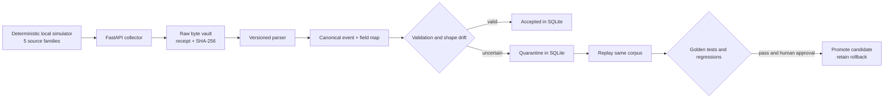

# LogProof

Local-first Smart India Hackathon 2026 demonstration for log preprocessing assurance. The working proof paths are **mapping failure → preserved evidence → replay-gated parser promotion**. All sample logs are generated on the presenter laptop.

## Run locally on Windows 11

Install Python 3.12+ and Node.js 22+ once. After dependencies are installed, the demo itself needs no internet connection.

```powershell
python -m pip install -r backend/requirements.txt
npm ci
```

In one PowerShell window:

```powershell
python -m uvicorn backend.main:app --host 127.0.0.1 --port 8000
```

In another:

```powershell
npm run dev
```

Open **http://localhost:3000**. The API is at **http://127.0.0.1:8000**. The backend seeds one baseline event from each of five source families on first launch. Data persists under `data/` until reset.

For Linux or macOS, use the same commands in separate terminals. Set `LOGPROOF_DATA` to a local directory if you want a different storage location.

## Docker Compose

Where Docker Compose is installed:

```sh
docker compose up --build
```

The web app binds to localhost port 3000 and the API to localhost port 8000. The raw vault and SQLite database are bind-mounted from `./data`. Images need to be built while dependencies are available; the running demo uses no external services. Docker was not available in the development environment, so this path is provided but has not been run here.

## Pricing proposal

The **Pricing** section presents an illustrative India-market packaging proposal from the supplied pricing reference: Community, Team, Secure, Enterprise / Government, and a 12-week paid pilot. Its rupee amounts are proposal figures, not live commercial terms. Daily ingest limits, HA, RBAC, signed packs, air-gap bundle flows, and support levels are proposed targets and have not been demonstrated by this prototype. Hardware, storage, taxes, travel, and custom integrations would need separate scoping.

A last-30-days research pass for 25 August–24 September 2026 returned thin, partly rate-limited discussion and did not validate willingness to pay or these rupee price points. Current vendor pages show that log products may combine ingest-volume and support/package dimensions, but they are not direct price comparators for LogProof ([Cribl pricing](https://cribl.io/pricing/plan/), [Datadog log billing](https://docs.datadoghq.com/account_management/billing/log_management/)). A buyer pilot and measured workload are needed before using these figures as a quote.

## Why LogProof

The **Why LogProof** section explains the purpose of the prototype: make the conversion from raw security logs to structured events inspectable, and make parser changes reviewable. Its assurance sequence links directly to the Evidence explorer, Drift watch, and Replay lab. The competitor comparison acknowledges existing preview, simulation, replay, and transform-test capabilities; it describes each product's documented role and LogProof's proposed emphasis without claiming missing features. Source links and claim boundaries are recorded in [the product marketing context](.agents/product-marketing.md). The downstream SIEM placement is conceptual; this prototype does not export to one.

## Two-to-four-minute jury walkthrough

1. **Overview → Start guided demo.** Show five local source formats and live receipts. Each event is saved to the raw vault before parsing.
2. **Drift watch → Trigger format change.** The firewall's `rule` changes from a string to an object. The active v1.4.2 parser cannot map it, so the event is quarantined and its type change is shown.
3. **Evidence explorer.** Select that receipt. Show its exact raw text, SHA-256 integrity check, parser version, and field-to-source mapping. Clicking a mapped field highlights its source in the raw view.
4. **Replay lab → Run replay.** The old and candidate parsers process identical golden and stored samples. Show rule mapping restoration, required-field coverage, golden results, and regression count.
5. Enter the presenter's name and choose **Approve & promote**. The active parser becomes v1.4.3; v1.4.2 remains the rollback target. The registry shows each local pack checksum. Use **Roll back parser** to demonstrate recovery.

Use **Reset demo** in the footer, or run `scripts/reset_demo.ps1`, to clear local records and reseed the five baseline events. Reset also returns the active firewall parser to v1.4.2.

## Architecture



The collector receives raw bytes at `POST /api/ingest/{source_id}`. It assigns a receipt ID, writes those bytes to `data/raw/`, records their SHA-256, and only then invokes a deterministic parser. Normalized events, quality, parser version, shape, and field mapping are kept in SQLite. `GET /api/evidence/{receipt_id}` rereads the original file and verifies its hash. The hash proves integrity of ingested bytes relative to this local vault; it does not prove the source device's identity.

Firewall parser packs live under `parsers/paloalto-traffic/{version}/`. Each has `manifest.yaml`, `rules.yaml`, `golden_samples.jsonl`, `expected_outputs.jsonl`, and `checksum.sha256`. The YAML files use JSON syntax, which is a valid YAML subset and needs no extra parser dependency. The backend loads the rule mapping from the selected pack, computes pack checksums, and verifies the candidate checksum before promotion. The checksums are local integrity checks, not digital signatures.

## API and controls

FastAPI documents all routes at `/docs` while the backend runs. Key endpoints: `/api/overview`, `/api/events`, `/api/evidence/{receipt_id}`, `/api/drift`, `/api/quarantine`, `/api/simulator/scenario/{baseline|mapping-failure|malformed|reset}`, `/api/replay`, `/api/parser/approve`, and `/api/parser/rollback`. Source simulation controls support starting, stopping, per-source pause, rate 1–5/s, and one-event emission. The UI polls the local API every 2.5 seconds.

## Verification

```powershell
python scripts/smoke.py
npm run build
```

The smoke check uses temporary storage, so it does not change demo data. It checks ingest, quarantine, drift, raw-hash verification, replay gates, promotion, and rollback.

## Implemented and future work

Implemented: five local source generators; raw evidence vault; SQLite event metadata; deterministic parsing; firewall shape drift and quarantine; field-level mapping; equal-corpus replay; golden checks; named human approval; versioned parser packs with local checksums; rollback; responsive console and one-click reset.

Future: actual syslog UDP/TCP listeners, streaming backpressure, configurable parser rules loaded from manifests, Ed25519-signed parser packs, source authentication, broader schema baselines, complete OCSF mapping, multiuser approvals, and performance benchmarking. UI figures are computed from the running demo or explicitly marked as measured. This is a prototype, not a production SIEM.

## Troubleshooting

- If the UI says the API is disconnected, start `uvicorn` and confirm `http://127.0.0.1:8000/api/health` responds.
- If ports 3000 or 8000 are occupied, stop the other process before starting this demo. The frontend currently expects the API on port 8000.
- If the parser candidate cannot be promoted, run replay and inspect the gates. A deliberately malformed firewall event in the corpus blocks promotion; reset the demo to return to the clean scenario.
- If offline startup fails after checkout, install Python and npm dependencies once while online, then run the demo offline.
