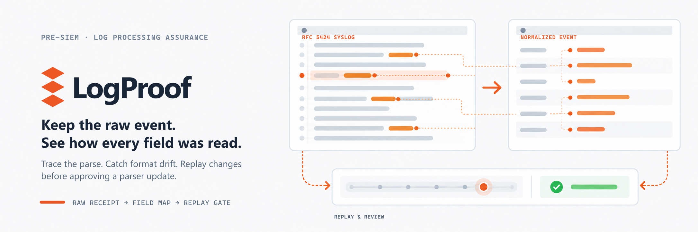
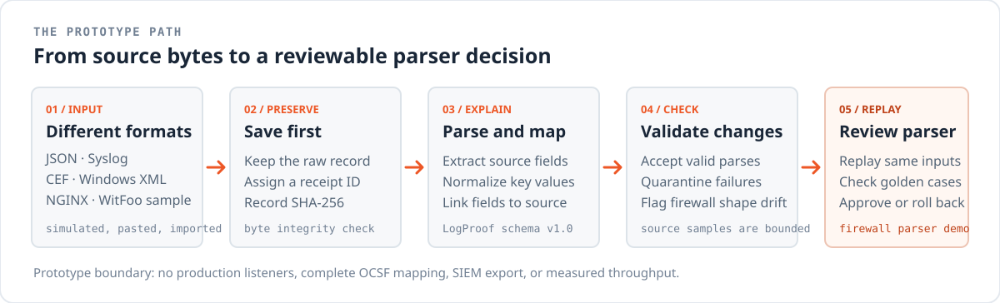

<p align="center">
  
</p>

<h1 align="center">LogProof</h1>

<p align="center"><strong>A local-first prototype for inspecting security log parsing and reviewing parser changes.</strong></p>

<p align="center">
  Preserve the raw event · Trace normalized fields · Detect parser drift · Replay before approval
</p>

## See the processing path

LogProof stores each received event before parsing, maps normalized fields back to the source record, and quarantines failed or incomplete parses. The parser replay and approval flow is currently implemented for the firewall example.

<p align="center">
  
</p>

## Formats in the demo

The simulator creates ten sample source families across eight raw formats. In **Live ingestion**, you can paste one event (up to 256 KB), import a mixed-format NDJSON batch, or export all event records. Samples are synthetic unless identified as the optional WitFoo dataset import.

| Sample source | Raw format | Example fields or behavior |
| --- | --- | --- |
| Firewall | JSON | Time, action, source/destination IP, rule, severity; deliberate rule-shape drift |
| Cisco-style router | RFC 3164-style Syslog | PRI severity, timestamp, device message |
| Syslog event | RFC 5424 | PRI, timestamp, host, application, message ID, structured data and message |
| Security device | CEF | Event header, severity, timestamp, source/destination, ports, protocol and action |
| Web server | NGINX combined access log | Client IP, time, method/path and response status |
| Windows security | Simplified JSON | Time, event ID and username; this is a sample, not native Event Viewer output |
| Windows Event | Event XML | Provider, event ID, time, channel, computer, username and source IP |
| Application | JSON | Time, message and user |
| Network flow | CSV | Header plus one row; timestamp, action, IPs, ports, protocol and severity |
| Security device | LEEF 1.0 / 2.0 | Event ID, vendor/product, device time, source/destination, protocol and severity |

The CSV parser accepts one event per input with its header row. NDJSON batches contain one envelope per line: `{"source_id":"csv_network","raw":"timestamp,action\\n2026-09-24T12:34:56Z,allowed"}`. For non-UTF-8 event bytes, use `raw_base64` instead of `raw`. A batch may mix source IDs and raw formats. It is limited to 100 events, 2 MB total, and 256 KB per raw event; malformed or unknown-source lines are reported individually while valid records still receive their own raw evidence, receipt, and hash. Export is one complete stored event object per line at `GET /api/events/export.ndjson`, including the original raw text or base64 bytes for byte-exact round trips.

LEEF parsing covers common 1.0 tab-separated attributes and 2.0 literal/hex attribute delimiters. IBM describes LEEF headers, the tab delimiter, and the LEEF 2.0 alternate delimiter in its [LEEF event components reference](https://www.ibm.com/docs/en/qradar-on-cloud?topic=overview-leef-event-components). This parser supports representative fields and ISO 8601 or epoch timestamps; it is not a full implementation of every vendor extension. The Cisco parser recognizes the demo's common RFC 3164-style pattern, not every RFC 3164 variant. RFC 5424, CEF, and Windows XML are likewise prototype parsers. An optional bounded import fetches sanitized events from the [WitFoo Precinct6 dataset](https://huggingface.co/datasets/witfoo/precinct6-cybersecurity-100m); it does not download the full dataset and requires network access.

## Run locally

**Requirements:** Python 3.12 or later and Node.js 22 or later.

Install dependencies once:

```powershell
python -m pip install -r backend/requirements.txt
npm ci
```

Start the API in one terminal:

```powershell
python -m uvicorn backend.main:app --host 127.0.0.1 --port 8000
```

Start the web app in another:

```powershell
npm run dev
```

Open <http://localhost:3000>. The API documentation is at <http://127.0.0.1:8000/docs>. Generated events and evidence are stored in `data/`; reset the demo from the app footer.

## Run with Docker Compose

Docker Compose builds the web and API containers. Their data directory is bind-mounted so events remain available in `data/` across container restarts.

```powershell
docker compose up --build
```

Open <http://localhost:3000>. If those ports are already in use, choose alternate host ports and an isolated data directory:

```powershell
$env:LOGPROOF_WEB_PORT = "3100"
$env:LOGPROOF_API_PORT = "8100"
$env:LOGPROOF_DATA_DIR = "$env:TEMP\logproof-compose-data"
docker compose up --build
```

Open <http://localhost:3100>. The API is available at <http://127.0.0.1:8100>. Stop the Compose services with `Ctrl+C`, or run `docker compose down` in another terminal.

## Verify the demo

```powershell
python scripts/smoke.py
npm run lint
npm run build
```

The smoke check uses a temporary database and verifies the ten source samples, CSV and LEEF parsing, LEEF 1.0 tabs and a LEEF 2.0 hex delimiter, mixed-source NDJSON import/export, raw-hash checks, malformed-input quarantine, firewall drift, parser replay, approval, rollback, and the labeled parser-evaluation fixtures.

### Parser evaluation

In **Replay lab**, choose **Evaluate parsers** to compare the ten demo parser families against 20 hand-authored fixtures: one valid and one malformed case per source. The local, read-only endpoint is `GET /api/parser/evaluation`; fixture definitions live in `backend/fixtures/parser_evaluation.jsonl`.

The report calculates exact normalized-field precision, recall and F1 from labeled key/value pairs; quarantine precision, recall and F1 from valid/malformed fixture labels; exact fixture pass rate; expected field-value counts; and local run time. The firewall result uses its currently active parser version; the other demo parsers use version `1.0.0`. The fixtures are synthetic regression examples, so these scores do not estimate production accuracy, real-world generalization, parser coverage, or ministry readiness. Add independently labeled examples from representative production sources before using the metrics to compare parser quality beyond the demo.

The Docker Compose path was built and run with Docker Desktop using host ports 3100/8100 and a temporary data directory. The web page returned HTTP 200; the API health check, ten-source overview, CORS, and raw ingestion plus evidence-hash verification for RFC 5424, CEF, and Windows Event XML passed.

### Bounded local workload

Run `python scripts/benchmark_ingest.py --count 1000` (the script hard-caps runs at 5,000 events). It uses temporary local storage and synchronously exercises parse, hash, raw-file write, and SQLite receipt write over all ten synthetic source families. One 1,000-event run on Windows 11, Python 3.12.6, completed in 15.982 seconds: **62.57 events/second**, 13.040 ms median and 18.392 ms p95 per-event latency, across 153,345 raw bytes. This is a sequential single-process microbenchmark with no HTTP, concurrency, or production-sized data; it is not a capacity or scale claim.

### Offline container transfer

`scripts/export_offline_bundle.ps1` builds fixed-tag API and web images, saves them to `logproof-images.tar`, includes Compose configuration and a matching `.env`, and writes a manifest plus SHA-256 checksum. For example:

```powershell
.\scripts\export_offline_bundle.ps1 -BundleDirectory "$env:TEMP\logproof-offline" -WebPort 3100 -ApiPort 8100
```

Copy the complete output folder to the target machine, check the tar hash against `SHA256.txt`, then run:

```powershell
docker load --input .\logproof-images.tar
docker compose --env-file .env up --no-build --pull never -d
```

The app images include parsers, application code, and runtime dependencies. The target needs Docker Engine and the Compose plugin; it does not need the source tree or registry access to start the packaged services. A transfer-path check removed the two uniquely tagged app images from this Docker engine, loaded them from the generated tar, and started Compose with `--no-build --pull never`. The frontend returned HTTP 200; the API exposed ten sources, accepted a LEEF batch record, and returned a successful NDJSON export. This verifies a no-pull image archive load/start on this engine; it is not a deployment test on a separate air-gapped ministry host. Persistent `./data` should be backed up separately. The optional WitFoo fetch needs a network connection.

## What is implemented

- A local API and web console with ten synthetic source families, single-event ingestion, mixed-source batch import, and NDJSON export.
- Raw event storage before parsing, receipt IDs, recorded SHA-256 hashes, and field-to-source mappings.
- Representative parsers for JSON, CSV, LEEF, Cisco-style Syslog, RFC 5424, CEF, NGINX combined logs, and Windows Event XML.
- Validation and quarantine for malformed or incomplete records; firewall shape-drift detection.
- A read-only evaluation endpoint and Replay lab view with per-source field precision/recall/F1, malformed-event quarantine precision/recall/F1, fixture pass rate, and local execution time across curated synthetic cases.
- A versioned firewall parser example with golden samples, equal-corpus replay, named approval, and rollback.
- A bounded optional WitFoo dataset import with dataset attribution.
- Dockerfiles, Compose configuration, and an offline image bundle/export workflow for running the two application services locally or transferring their images without registry pulls.

## Prototype boundaries

LogProof is a hackathon prototype, not a universal preprocessing platform or production SIEM. Its canonical schema is LogProof's own limited schema; it does not provide a complete OCSF mapping. Parsers use explicit source mappings, and only the firewall parser participates in replay and promotion. The project does not yet provide native network listeners, streaming backpressure, source authentication, SIEM or data lake export, multi-user access controls, or a production throughput assessment. SQLite and local file storage have not been load-tested for ministry or billion-event workloads.

The recorded SHA-256 digest checks whether stored bytes still match the digest captured on receipt. It does not authenticate the sending device or prove who originally produced a log.

## References

- [Next.js: hydration error causes and `suppressHydrationWarning`](https://nextjs.org/docs/messages/react-hydration-error)
- [Python `csv` module documentation](https://docs.python.org/3/library/csv.html)
- [NDJSON specification](https://github.com/ndjson/ndjson-spec)
- [IBM QRadar: LEEF event components](https://www.ibm.com/docs/en/qradar-on-cloud?topic=overview-leef-event-components)
- [RFC 5424: The Syslog Protocol](https://www.rfc-editor.org/rfc/rfc5424)
- [Docker image save and load reference](https://docs.docker.com/reference/cli/docker/image/)
- [WitFoo Precinct6 Cybersecurity dataset card on Hugging Face](https://huggingface.co/datasets/witfoo/precinct6-cybersecurity-100m)
- [Hugging Face Datasets documentation](https://huggingface.co/docs/datasets/index)
- [Local bounded workload procedure and script](scripts/benchmark_ingest.py)
